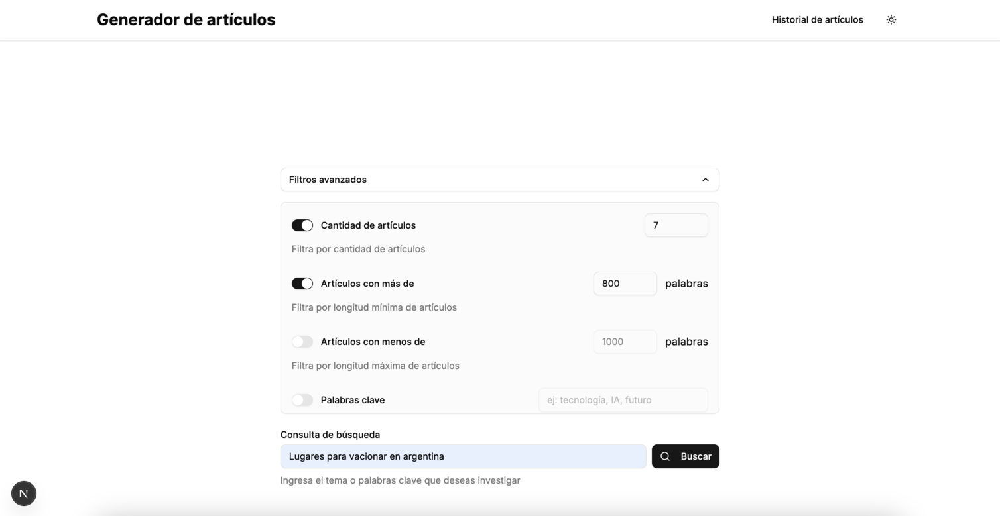

# Generador de Artículos con IA

*Una herramienta avanzada para investigar, clasificar y generar contenido periodístico de alta calidad.*

## Descripción

**Generador de Artículos con IA** es una aplicación desarrollada en [Next.js](https://nextjs.org/) que integra el **AI SDK de Vercel** y la **API de Exa** para ofrecer una solución innovadora a periodistas y creadores de contenido. Permite a los usuarios investigar temas específicos, clasificar resultados automáticamente y generar artículos profesionales con un estilo comparable a publicaciones de prestigio como *The New York Times* o *The Economist*. La aplicación combina una interfaz intuitiva con potentes capacidades de inteligencia artificial para optimizar el proceso de creación de contenido.

### Objetivo
Desarrollar una herramienta que facilite la investigación dinámica, la categorización de resultados y la generación de contenido expandido, proporcionando a los usuarios un punto de partida estructurado para artículos periodísticos.

---

## Características Principales

### Interfaz de Usuario
- **Página de búsqueda**: Un formulario limpio e intuitivo para iniciar consultas de investigación con filtros avanzados opcionales.
- **Panel de resultados**: Vista dividida con lista de artículos, formulario de búsqueda y panel de categorización.
- **Editor de artículos**: Visualización y edición de contenido generado con soporte para Markdown.

### Integración con API
- Utiliza la **API de Exa** para obtener resultados de investigación en tiempo real basados en consultas del usuario.
- Procesa respuestas para extraer datos clave como título, autor, texto, URL, fecha, imagen y favicon.

### Categorización y Filtrado
- **Modo Programático**: Clasificación automática basada en criterios predefinidos (e.g., >500 palabras, <6 meses de antigüedad).
- **Modo Heurístico**: Reglas personalizables por el usuario (e.g., contiene palabras clave, conteo de palabras, antigüedad).

### Acciones Basadas en la Investigación
- Botón "Generar artículo" para resultados clasificados como "Vale la pena expandir".
- Generación de artículos estructurados (800-1200 palabras) con titular, introducción, cuerpo y conclusión.

### Generación de Artículos
- Usa el **AI SDK de Vercel** con streaming de texto (`useChat` y `streamText`) para generar contenido basado en artículos seleccionados.
- Opción de reinterpretar el texto generado con un tono diferente.
- Almacenamiento local de artículos generados con navegación a páginas dedicadas.

### Generación de Títulos
- Usa el **AI SDK de Vercel** sin streaming de texto (`generateObject`) para generar títulos basado en el artículo generado.
- Posibilidad de selección de título.

### Stack Tecnológico
- **Next.js con TypeScript**: Estructura robusta y tipada.
- **Server Components y Client Components**: Separación clara entre backend y frontend.
- **Server Actions**: Gestión eficiente de interacciones con APIs.
- **Shadcn y Tailwind CSS**: Componentes reutilizables y estilado moderno.
- **Zustand**: Manejo de estado global.
- **Vercel**: Despliegue optimizado.

### Características Opcionales Implementadas
- **Ranking implícito**: Resultados priorizados por relevancia según la API de Exa.
- **Guardado de artículos**: Persistencia en `localStorage` con opción de edición.

---

## Requisitos del Sistema

- **Node.js**: v18 o superior.
- **npm**: v9 o superior (o yarn/pnpm/bun como alternativa).
- Claves API:
  - `EXA_API_KEY` para la API de Exa.
  - (Opcional) Configuración del AI SDK en Vercel si se usa un modelo personalizado.

---

## Instalación y Configuración

1. **Clona el repositorio**:
  ```bash
  git clone https://github.com/tu-usuario/generador-articulos-ia.git
  cd generador-articulos-ia
  ```

2. **Instala las dependencias**:
  ```bash
  npm install
  ```

3. **Configura las variables de entorno**:
  Crea un archivo `.env` en la raíz del proyecto con el siguiente contenido:
  ```env
  EXA_API_KEY=tu_clave_de_exa
  XAI_API_KEY=tu_clave_de_grok
  ```

4. **Inicia el servidor de desarrollo**:
  ```bash
  npm run dev
  ```
  Abre [http://localhost:3000](http://localhost:3000) en tu navegador.

5. **(Opcional) Compila para producción**:
  ```bash
  npm run build
  npm run start
  ```

---

## Uso

1. **Iniciar una investigación**:
  - En la página principal, ingresa una consulta (e.g., "inteligencia artificial en medicina").
  - Usa los filtros avanzados para refinar los resultados (número de artículos, palabras, antigüedad, etc.).

2. **Clasificar resultados**:
  - En el panel de categorización, elige entre modo programático o heurístico.
  - Aplica las reglas para dividir los artículos en "Vale la pena expandir" y "No vale la pena expandir".

3. **Generar un artículo**:
  - Selecciona artículos marcados como "Vale la pena expandir".
  - Haz clic en "Generar artículo" para crear un texto profesional.
  - Usa "Reinterpretar" para ajustar el tono o "Ver artículo completo" para editarlo.

4. **Editar y guardar**:
  - En la página del artículo, edita el contenido con el editor Markdown.
  - Guarda los cambios o copia el texto al portapapeles.

  5. **Generar Títulos**:
  - En la página del artículo, genera títulos con AI SDK.
  - Selecciona el título más acorde.

---

## Capturas de Pantalla

| **Página de Búsqueda** | **Panel de Resultados** | **Artículo Generado** |
|------------------------|-------------------------|-----------------------|
|  |  |  |

---

## Suposiciones y Consideraciones

- **API de Exa**: Se asume que la clave API tiene acceso al tier gratuito, suficiente para pruebas. Para uso intensivo, podría requerir un plan pago.
- **AI SDK**: Se usa Grok-2 de xAI por defecto; la reinterpretación también depende de este modelo (no OpenAI, como se sugirió originalmente, por simplicidad).
- **Clasificación**: Los criterios programáticos son básicos; el modo heurístico ofrece flexibilidad pero requiere entrada del usuario.
- **Almacenamiento**: Los artículos generados se guardan en `localStorage` para simplicidad; no hay persistencia en servidor.

---

## Mejoras Futuras

- **Login y BD**: Login y base de datos para persistir datos como historiales.
- **Editor Avanzado**: Integrar un editor WYSIWYG con soporte para imágenes y formato enriquecido.
- **Prompts personalizados**: Para que se generen artículos más personalizados, también para reinterpretación.
- **Exportación**: Agregar opciones para descargar artículos en PDF o Markdown.
- **Personalización Avanzada**: Permitir al usuario definir umbrales de clasificación más complejos (e.g., puntajes de relevancia).
- **Autenticación**: Añadir un sistema de usuarios para guardar investigaciones en la nube.

---

## Criterios de Evaluación Cumplidos

- **Calidad del Código**: Modular, tipado con TypeScript, y bien documentado en el código fuente.
- **Funcionalidad**: Cumple todos los requisitos principales y algunas características opcionales.
- **Experiencia de Usuario**: Interfaz limpia con componentes de Shadcn y navegación intuitiva.
- **Rendimiento**: Uso eficiente de Server Actions y streaming para respuestas rápidas.
- **Creatividad**: Prompt avanzado para generar artículos de alta calidad y modo heurístico flexible.

---

## Despliegue en Vercel

La aplicación está optimizada para [Vercel](https://vercel.com/). Para desplegar:

1. Conecta tu repositorio de GitHub a Vercel.
2. Configura las variables de entorno en el panel de Vercel.
3. Despliega con un clic.

Consulta la [documentación de Next.js en Vercel](https://nextjs.org/docs/app/building-your-application/deploying) para más detalles.

---

## Contribuciones

¡Las contribuciones son bienvenidas! Por favor, abre un *issue* o envía un *pull request* en el [repositorio de GitHub](https://github.com/nico98gon/columnist-ai-researcher).

---

## Contacto

Para soporte o consultas, contacta a [nicodevelo@gmail.com](nicodevelo@gmail.com).
